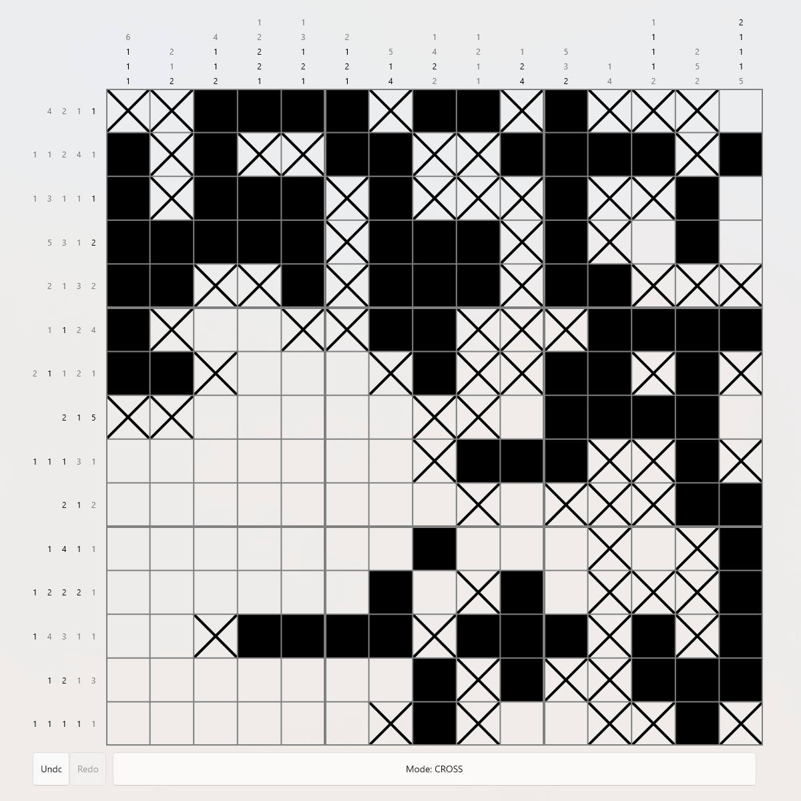

# NonoSharp
[](https://img.shields.io/nuget/vpre/NonoSharp?label=NuGet)
[](https://github.com/GiraffeLars/NonoSharp/actions/workflows/test-api.yml)
[](https://github.com/GiraffeLars/NonoSharp/actions/workflows/build-windows.yml)

A cross-platform Nonogram game built with C# and .NET MAUI, featuring pre-made and randomly generated puzzles together with a reusable game logic API.

> Status: Currently in-development. A beta build is available in [Releases](https://github.com/GiraffeLars/NonoSharp/releases).




## What is NonoSharp?
NonoSharp is an API for C#, together with an example UI consumer, allowing for easy creation and playing of [Nonogram](https://en.wikipedia.org/wiki/Nonogram) (also known as Picross) puzzles.
Nonograms are Japanese puzzles where you fill in a picture based on hints given to you.
The hints, either on the left-side or top-side of the grid, show how many groups there are in a given row/column and show how many cells each group consists of.
By filling the grid one cell at a time, eventually you reach the solution.

## Features
- **A fully functional Nonogram game**, complete with hint checking
- An **API** allowing for game logic to be reused in other projects
- **Randomly generated puzzles** guaranteed to be uniquely solvable as verified by the built-in solver
- **Cross-platform** UI built with MAUI

## Using the API
Since the core logic is separate from the UI, it can be reused in other projects. To add the API
to your project, you can install it from [NuGet](https://www.nuget.org/packages/NonoSharp/#readme-body-tab),
for example by running the following command. This will install the latest version and add it to
your project.
```shell
dotnet add package NonoSharp
```

Currently supported functions include:
- Abstracted grid, making it easy to implement in your projects
- Built-in undo/redo functionality
- Checking whether the puzzle is solved
- A hint system, together with whether a hint is completed by the user.
- Events for cells changing states and the puzzle being solved correctly
- Generating random uniquely solvable puzzles
- Loading and saving puzzles to a custom file type

### Example usage
```csharp
using NonoSharp;
using NonoSharp.Events;
 
// Creates a new random 10x10 puzzle. Generation is guaranteed to produce a solvable puzzle.
// This method is also available asynchronously via NonogramAPI.CreateRandomPuzzleAsync
var game = NonogramAPI.CreateRandomPuzzle(10, 10); // (width x height)
 
// Fill in or cross a cell (coordinates are zero-indexed, (0, 0) is top-left)
game.FillCell(2, 3);
game.CrossCell(0, 0);
 
// Moves can be undone/redone
if (game.CanUndo)
{
    game.Undo();
}
 
// Check individual cell state
bool isFilled = game.IsCellFilled(2, 3);
 
// Check overall progress
if (game.IsPuzzleSolved())
{
    Console.WriteLine("Solved!");
} 
else 
{
    Console.WriteLine("Not solved :(");
}

 
// The hints shown alongside the grid (e.g. "3 1" for a row) are available for building your own UI
Hints[] columnHints = game.ColumnHints;
Hints[] rowHints = game.RowHints;

// There are also some events provided
game.CellStateChanged += (s, e) => {
    Console.WriteLine("A cell has changed states");

    // Include using NonoSharp.Events to gain access to the event args
};
```

## Getting Started
### Playing
To play the game build upon the API, install the beta release in the [Releases](https://github.com/GiraffeLars/NonoSharp/releases) tab.
Currently, only a build for Windows is available. If you wish to play on a different platform, see the section below.

### Contributing
To contribute, clone the project and open it in your prefered IDE, such as Visual Studio. The project makes use of [.NET 10.0](https://dotnet.microsoft.com/en-us/download/dotnet/10.0), [MAUI](https://dotnet.microsoft.com/en-us/apps/maui) and [sqlite-net-pcl](https://www.nuget.org/packages/sqlite-net-pcl/).
> **Note:** I cannot guarantee (full) functionality on operating systems other than Windows or Android. While other MAUI platforms are supported, they may contain unexpected issues. 
> Some features may not be available on all operating systems due to MAUI limitations.

### Installing dependencies
In order to build the project, you will need, as mentioned above, .NET 10.0, .NET MAUI and sqlite-net-pcl. To install the .NET MAUI workload, run the following command in your terminal
```
dotnet workload install maui
```
Alternatively, it is also possible to automatically install the workload when installing Visual Studio by selecting the corresponding option in the installer.

After .NET MAUI has successfully installed, clone the project and open it in your IDE. Before building the project, run the following command. This will install required dependencies, such as sqlite-net-pcl and fix other possible issues. 
```
dotnet restore
```
### Building the project
After setting everything up, you can build the MAUI project with
```
dotnet build src/NonoSharp.Maui/NonoSharp.Maui.csproj
```
Similarly, if you wish to build just the API, run
```
dotnet build src/NonoSharp/NonoSharp.csproj
```

Of course, you are also welcome to use your IDE's debugger to build the project and/or play it.

### Unit tests
The API project is paired with a test suite found in `tests/NonoSharp.Tests`. To run the tests, either use your IDE's unit testing features or run the following:
```
dotnet test tests/NonoSharp.Tests/NonoSharp.Tests.csproj
```
When contributing, please ensure that the unit tests all pass. These will also be checked when opening a pull request.

## Roadmap
Features that are currently planned to be added *(in no particular order)*:
- [x] Random puzzle generation that have a guaranteed solution
- [x] Automatically cross the remaining blank cells upon line completion
- [x] Dark mode support
- [x] Support for pre-made puzzles
- [ ] Improve player controls on PC
- [ ] Player statistics
- [ ] UI improvements
- [ ] Player-created puzzles and puzzle creator

## Contribution guidelines
This project started as a solo learning project, but contributions are welcome. Please open a PR or an issue if you wish to contribute. 

When submitting a pull request, please make note of the following:
- Keep PRs focussed
- If you make any changes to the logic, ensure that the tests verify
- Make sure the project builds and functions as intended
- Keep code documented
- Try to keep AI generated code at a minimum

## License
This project is licensed under the **MIT License**. See the `LICENSE` file.
